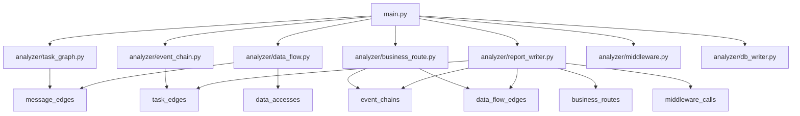

# 実装仕様書

本書は、`docs/future_implementation_plan.md` に基づいて実装されたフェーズ3〜7の詳細仕様を記載します。

## 対象ファイル

| フェーズ | ファイル | 役割 |
|---|---|---|
| フェーズ3 | `analyzer/task_graph.py` | タスク相関図生成 |
| フェーズ4 | `analyzer/event_chain.py` | イベント別タスクチェーン追跡 |
| フェーズ5 | `analyzer/data_flow.py` | データフロー解析 |
| フェーズ6 | `analyzer/business_route.py` | 業務処理ルート解析 |
| フェーズ7 | `analyzer/report_writer.py` | HTMLレポート生成 |

`main.py` の `--mode` 選択肢に以下の5モードが追加されました:

```
task-graph
event-chain
data-flow
business-route
report
```

---

## 共通設計方針

### データベース

DBファイルは `output/c_analysis.db`（config.py の DB_PATH）を使用します。

各モジュールは実行時に自身のテーブルを `DROP TABLE IF EXISTS` + `CREATE TABLE IF NOT EXISTS` で初期化します。

### 出力ディレクトリ

特に指定がない限り `output/` ディレクトリに出力します。

### UNKNOWN の扱い

- NULL や空文字列はすべて `"UNKNOWN"` に統一
- `UNKNOWN` を除外しない
- `UNKNOWN` を含む行も低 confidence として保持

### ファイル名の安全化

ファイル名に使用できない文字（`<>:"/\\|?*` など）は `_` に置換します。

---

## フェーズ3: task-graph

### ファイル

`analyzer/task_graph.py`

### CLI

```powershell
python main.py --mode task-graph
python main.py --mode task-graph --event イベントID
```

### 入力テーブル

- `message_edges`

### 出力テーブル

`task_edges`

```sql
CREATE TABLE IF NOT EXISTS task_edges (
    id INTEGER PRIMARY KEY AUTOINCREMENT,
    event_id TEXT,
    from_task TEXT,
    to_task TEXT,
    message_id TEXT,
    data_name TEXT,
    caller_function TEXT,
    file_id INTEGER,
    line INTEGER,
    confidence REAL,
    edge_reason TEXT
);
```

### 出力ファイル

| 条件 | Excel | DOT |
|---|---|---|
| `--event` なし | `output/task_graph.xlsx` | `output/task_graph.dot` |
| `--event EVT001` | `output/task_graph_EVT001.xlsx` | `output/task_graph_EVT001.dot` |

### 処理フロー

1. `message_edges` テーブルから全行を取得（`--event` 指定時は WHERE event_id = ?）
2. `from_task`, `to_task` を正規化（NULL/空は `UNKNOWN`）
3. `from_task → to_task` のエッジレコードを作成
4. `task_edges` テーブルに INSERT
5. Excel 出力
6. DOT 出力（重複エッジを集約）

### DOT仕様

- ノード: タスク名
- エッジ: `from_task → to_task`
- ラベル: event_id, message_id, data_name, count, confidence
- ランク方向: LR（左から右）

### 受け入れ条件

- [x] `message_edges` が空でもエラー終了しない
- [x] 0件の場合も空のExcel/DOTを出力する
- [x] `--event` 指定時に対象イベントだけ出る
- [x] `UNKNOWN` を含む行も欠落しない

### 主要関数

```python
def build_task_edges(
    db_path: Path = DB_PATH,
    event_id: str | None = None,
    output_dir: Path | None = None,
) -> dict[str, Any]:
    """
    Returns:
        count: 生成したエッジ数
        excel_path: 出力したExcelファイルのパス
        dot_path: 出力したDOTファイルのパス
    """
```

---

## フェーズ4: event-chain

### ファイル

`analyzer/event_chain.py`

### CLI

```powershell
python main.py --mode event-chain --event イベントID
```

### 入力テーブル

- `task_edges`（フェーズ3で生成）

### 出力テーブル

`event_chains`

```sql
CREATE TABLE IF NOT EXISTS event_chains (
    id INTEGER PRIMARY KEY AUTOINCREMENT,
    event_id TEXT,
    depth INTEGER,
    route_order INTEGER,
    from_task TEXT,
    to_task TEXT,
    message_id TEXT,
    data_name TEXT,
    caller_function TEXT,
    file_path TEXT,
    line INTEGER,
    confidence REAL,
    visited_key TEXT
);
```

### 出力ファイル

| 条件 | Excel | DOT |
|---|---|---|
| `--event EVT001` | `output/event_chain_EVT001.xlsx` | `output/event_chain_EVT001.dot` |

### 処理フロー

1. `task_edges` から指定 `event_id` の行を取得
2. `from_task` をキーとする隣接リスト（グラフ）を構築
3. 各タスクの入次数（in-degree）を計算
4. 開始候補タスクを決定:
   - 入次数が0のタスクを優先
   - 全タスクに入力がある場合は最小入次数のタスク
5. BFS（幅優先探索）でグラフを走査:
   - `visited_key = event_id + from_task + to_task + message_id + data_name` でループ防止
   - `depth` を付与（0始まり）
   - `route_order` を採番
6. `event_chains` テーブルに INSERT
7. Excel 出力
8. DOT 出力（集約エッジ + depth情報）

### 循環防止

`visited_key` を使用して、同一のエッジを二度処理しないようにします。

```python
visited_key = f"{event_id}|{from_task}|{to_task}|{message_id}|{data_name}"
```

### 受け入れ条件

- [x] 循環があっても無限ループしない
- [x] `depth` と `route_order` が付与される
- [x] `UNKNOWN` を含むタスクも欠落しない
- [x] `event_id` が存在しない場合は0件で終了する

### 主要関数

```python
def build_event_chain(
    event_id: str,
    db_path: Path = DB_PATH,
    output_dir: Path | None = None,
    max_depth: int = 50,
) -> dict[str, Any]:
    """
    Returns:
        count: 生成したチェーンレコード数
        excel_path: 出力したExcelファイルのパス
        dot_path: 出力したDOTファイルのパス
    """
```

---

## フェーズ5: data-flow

### ファイル

`analyzer/data_flow.py`

### CLI

```powershell
python main.py --mode data-flow
python main.py --mode data-flow --event イベントID
python main.py --mode data-flow --data データ名
python main.py --mode data-flow --event イベントID --data データ名
```

### 入力テーブル

- `message_edges`
- `data_accesses`

### 出力テーブル

`data_flow_edges`

```sql
CREATE TABLE IF NOT EXISTS data_flow_edges (
    id INTEGER PRIMARY KEY AUTOINCREMENT,
    event_id TEXT,
    from_task TEXT,
    to_task TEXT,
    from_function TEXT,
    to_function TEXT,
    data_name TEXT,
    data_kind TEXT,
    direction TEXT,
    access_type TEXT,
    source_type TEXT,
    file_id INTEGER,
    line INTEGER,
    confidence REAL,
    reason TEXT
);
```

### 出力ファイル

| 条件 | Excel | DOT |
|---|---|---|
| なし | `output/data_flow.xlsx` | `output/data_flow.dot` |
| `--event EVT001` | `output/data_flow_EVT001.xlsx` | `output/data_flow_EVT001.dot` |
| `--data DATA_X` | `output/data_flow_DATA_X.xlsx` | `output/data_flow.dot` |
| `--event EVT001 --data DATA_X` | `output/data_flow_EVT001_DATA_X.xlsx` | `output/data_flow_EVT001.dot` |

### 処理フロー

#### MESSAGE由来

`message_edges.data_name` を使用。

```
from_task --[SEND]--> data_name
to_task   --[RECEIVE]--> data_name
```

- direction: OUT（SEND）/ IN（RECEIVE）
- source_type: "message"
- data_kind: "message"

#### FILE / DB / SHARED 由来

`data_accesses` の WRITE と READ を同じ `data_name` でペアリング。

```python
# key = f"{data_name}|{data_kind}" でグループ化
write_accesses["FILE_X|file_write"] = [WRITEレコード...]
read_accesses["FILE_X|file_read"]  = [READレコード...]
```

| 元のdata_kind | source_type | data_kind |
|---|---|---|
| file_write / file_read | file | file |
| db_write / db_read | db | db |
| shared_write / shared_read | shared_memory | shared_memory |

ペアリング後のレコード:

```
TASK_A --[WRITE]--> FILE_X
TASK_B --[READ]--> FILE_X
```

- confidence: WRITE と READ の confidence の最小値
- from_task: WRITE側のタスク
- to_task: READ側のタスク

### 受け入れ条件

- [x] message / file / db / shared の各ソース種別が区別される
- [x] `--event` 指定で対象イベントに関連するデータだけを出せる
- [x] `--data` 指定で対象データだけを出せる
- [x] `UNKNOWN` は消さず、低confidenceとして残す

### 主要関数

```python
def build_data_flow(
    db_path: Path = DB_PATH,
    event_id: str | None = None,
    data_name: str | None = None,
    output_dir: Path | None = None,
) -> dict[str, Any]:
    """
    Returns:
        count: 生成したデータフローエッジ数
        excel_path: 出力したExcelファイルのパス
        dot_path: 出力したDOTファイルのパス
    """
```

---

## フェーズ6: business-route

### ファイル

`analyzer/business_route.py`

### CLI

```powershell
python main.py --mode business-route --event イベントID
```

### 入力テーブル

- `event_chains`（フェーズ4で生成）
- `data_flow_edges`（フェーズ5で生成）
- `files`

### 出力テーブル

`business_routes`

```sql
CREATE TABLE IF NOT EXISTS business_routes (
    id INTEGER PRIMARY KEY AUTOINCREMENT,
    event_id TEXT,
    route_order INTEGER,
    depth INTEGER,
    node_type TEXT,
    task_name TEXT,
    function_name TEXT,
    data_name TEXT,
    data_kind TEXT,
    action TEXT,
    next_task TEXT,
    file_path TEXT,
    line INTEGER,
    confidence REAL,
    reason TEXT
);
```

### node_type

| 値 | 説明 |
|---|---|
| EVENT | イベント開始/終了 |
| TASK | 処理タスク |
| FUNCTION | 関数呼び出し |
| MESSAGE | メッセージ送受信 |
| DATA | 汎用データ |
| FILE | ファイル読み書き |
| DB | データベース読み書き |
| SHARED_MEMORY | 共有メモリ読み書き |
| UNKNOWN | 不明 |

### action

| 値 | 説明 |
|---|---|
| START | イベント開始 |
| SEND | メッセージ送信 |
| RECEIVE | メッセージ受信 |
| READ | データ読み取り |
| WRITE | データ書き込み |
| CALL | 関数呼び出し |
| PROCESS | タスク処理 |
| END | イベント終了 |

### 出力ファイル

| 条件 | Excel | DOT | HTML |
|---|---|---|---|
| `--event EVT001` | `output/business_route_EVT001.xlsx` | `output/business_route_EVT001.dot` | `output/business_route_EVT001.html` |

### 処理フロー

1. `event_chains` から指定 `event_id` のチェーンを取得
2. `data_flow_edges` から関連データフローを取得（`event_id` またはタスク名で紐付け）
3. START ノードを追加
4. チェーンをループ処理:
   - FROMタスク（node_type=TASK, action=PROCESS）
   - メッセージ送信（node_type=MESSAGE, action=SEND）
   - データフロー（FILE/DB/SHARED_MEMORY, action=READ/WRITE）
   - TOタスク（node_type=TASK, action=RECEIVE）
5. END ノードを追加
6. `business_routes` テーブルに INSERT
7. Excel / DOT / HTML 出力

### 出力イメージ

```
EVT_START

[EVENT] EVT_START
  -> [TASK] TASK_A
       [WRITE] FILE_A
       [SEND] MSG_X / DATA_X
  -> [TASK] TASK_B
       [RECEIVE] MSG_X / DATA_X
       [READ] FILE_A
       [WRITE] TABLE_B
  -> [TASK] TASK_C
       [READ] TABLE_B
       [END]
```

### HTML出力の内容

- イベント概要（サマリーカード）
- UNKNOWN集計
- タスク相関図（折りたたみ可能テーブル）
- イベントチェーン（折りたたみ可能テーブル）
- データフロー（折りたたみ可能テーブル）
- 業務ルート（折りたたみ可能テーブル）
- ミドルウェア呼び出しリスト（折りたたみ可能テーブル）
- 追加調査が必要な箇所（UNKNOWN、低confidence、推奨アクション）

### 受け入れ条件

- [x] イベントID単位で1つのルート表が出る
- [x] 根拠となるファイルパス、行番号、confidenceが残る
- [x] UNKNOWNがある場合も表示される
- [x] Excelで現場レビューできる
- [x] HTMLでレビューできる

### 主要関数

```python
def build_business_route(
    event_id: str,
    db_path: Path = DB_PATH,
    output_dir: Path | None = None,
) -> dict[str, Any]:
    """
    Returns:
        count: 生成したルートステップ数
        excel_path: 出力したExcelファイルのパス
        dot_path: 出力したDOTファイルのパス
        html_path: 出力したHTMLファイルのパス
    """
```

---

## フェーズ7: report

### ファイル

`analyzer/report_writer.py`

### CLI

```powershell
python main.py --mode report --event イベントID
```

### 入力テーブル

- `task_edges`
- `event_chains`
- `data_flow_edges`
- `business_routes`
- `middleware_calls`
- `message_edges`
- `files`

### 出力ファイル

| 条件 | HTML |
|---|---|
| `--event EVT001` | `output/report_EVT001.html` |

### 出力HTMLの構成

1. ヘッダー（タイトル）
2. サマリーカード
   - Tasks
   - Messages
   - Task Graph Edges
   - Event Chain Records
   - Data Flow Edges
   - Business Route Steps
3. UNKNOWN サマリー
   - task_graph / event_chain / data_flow / business_route 別のUNKNOWN件数
4. 📊 Task Graph（折りたたみテーブル）
5. 🔗 Event Chain（折りたたみテーブル）
6. 💾 Data Flow（折りたたみテーブル）
7. 🛣️ Business Route（折りたたみテーブル）
8. ⚙️ Middleware Calls（折りたたみテーブル）
9. 🔍 Investigation Required
   - UNKNOWN Entries
   - Low Confidence Items
   - Recommended Actions

### テーブル表示の制限

- 最大200行まで表示
- 200行超の場合は「... and N more rows」を表示

### 主要関数

```python
def generate_report(
    event_id: str,
    db_path: Path = DB_PATH,
    output_dir: Path | None = None,
) -> dict[str, Any]:
    """
    Returns:
        html_path: 出力したHTMLファイルのパス
        count: business_route のレコード数
    """
```

### 内部関数

```python
def _get_event_info(conn, event_id) -> dict[str, Any]:
    """イベントの統計情報を取得"""

def _get_task_graph(conn, event_id) -> list[dict[str, Any]]:
    """task_edges を取得"""

def _get_event_chains(conn, event_id) -> list[dict[str, Any]]:
    """event_chains を取得"""

def _get_data_flows(conn, event_id) -> list[dict[str, Any]]:
    """data_flow_edges を取得"""

def _get_business_routes(conn, event_id) -> list[dict[str, Any]]:
    """business_routes を取得"""

def _get_middleware_calls(conn, event_id) -> list[dict[str, Any]]:
    """middleware_calls を取得（message_send/message_recvのみ）"""

def _get_unknown_summary(conn, event_id) -> dict[str, int]:
    """各テーブルのUNKNOWN件数を集計"""

def _build_html(...) -> str:
    """すべてのデータからHTML文字列を構築"""

def _write_html_table(lines, data, columns) -> None:
    """HTMLテーブルを出力（linesリストに追記）"""
```

---

## モジュール依存関係



## 実行順序（推奨）

```powershell
# 0. 前準備（既存）
python main.py --mode analyze
python main.py --mode middleware

# 1. タスク相関図
python main.py --mode task-graph

# 2. イベント別タスクチェーン
python main.py --mode event-chain --event イベントID

# 3. データフロー解析
python main.py --mode data-flow --event イベントID

# 4. 業務処理ルート解析
python main.py --mode business-route --event イベントID

# 5. HTMLレポート
python main.py --mode report --event イベントID
```

## 注意事項

1. `task-graph` は `middleware` 実行後にのみ動作します（`message_edges` が必要）
2. `event-chain` は `task-graph` 実行後にのみ動作します（`task_edges` が必要）
3. `business-route` は `event-chain` と `data-flow` 実行後にのみ動作します
4. `report` は全フェーズ実行後にのみ動作します
5. 各モジュールは入力テーブルが空でもエラー終了せず、空の出力ファイルを生成します